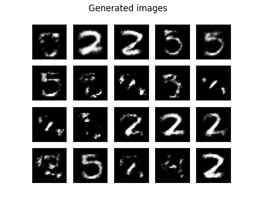
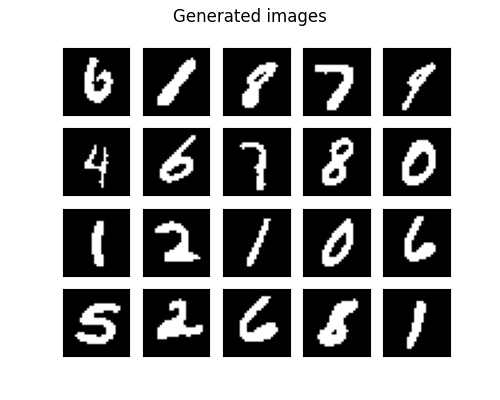

# Auto Encoder Image Generator

A neural network generating new MNIST images using an auto encoder trained on MNIST.
Both a standard auto encoder is implemented, as well as a variational auto encoder.

The MNIST data set is a large data set consisting of several thousand images of handwritten digits in the range 0 to 9. Each image is 28 by 28 pixels and has a corresponding ground truth for what that digit actually is. It is a very popular data set for starting out with deep learning, and achieving a good prediction accuracy for this data set is quite simple.

In this program, I use Auto Encoders to try and generate brand new images by training a deep neural network. This works by creating a deep neural network where one of the layers in the middle of the network are quite small, perhaps only 5 nodes. The first half of the network then tries to compress the 28x28=784 input down to 5 values, while the second half of the network tries to recreate the original image from these 5 values. By fitting the network on the MNIST images, we can train it to encode the images it receives as a 5x1 vector. If we sample random vectors from this vector space and send them through the second half of our network, the network should produce brand new images resembling its training data.

## Examples

When the standard Auto Encoder was trained on single channel MNIST, the generated images were not that great. Some digits are recognizable.

The Variational Auto Encoder performed much better. Here, almost all generated images resemble real digits, and the generated digits are much more varied.

More illustrations were also generated for anomaly detection and for multi-colorchannel MNIST dataset, stored in [`images/`](images/).

## Usage

To run this program, download or clone the repository and run using Python 3.9 or higher. This program also requires Tensorflow, which as of writing this is not supported for Python 3.10 and up.

### Download

Clone the project to any local directory and run the main script `deep_generative_model.py` using Python 3.9 or higher.

## Requirements

- Python 3.9 or higher
- Tensorflow (Verified to work with ver. 2.9.0)
- Tensorflow Probability (Verified to work with ver. 0.16.0)

## Configuration

Most settings must be changed in the code itself. The pivotal parameters of the program lies in the constructor of the `DeepGenerativeModel`-class in the `deep_generative_mode.py`-file. Here you can set whether to use a Variational Auto Encoder or a standard Auto Encoder as well as whether to use the stacked data set and whether to perform anomaly detection on the generated images.

## Acknowledgments

All code in `stacked_mnist.py` and `verification_net.py` were provided py course staff in IT3030 at NTNU.

## License

This code is protected under the [GNU General Public License 3.0](http://www.gnu.org/licenses/gpl-3.0.html)